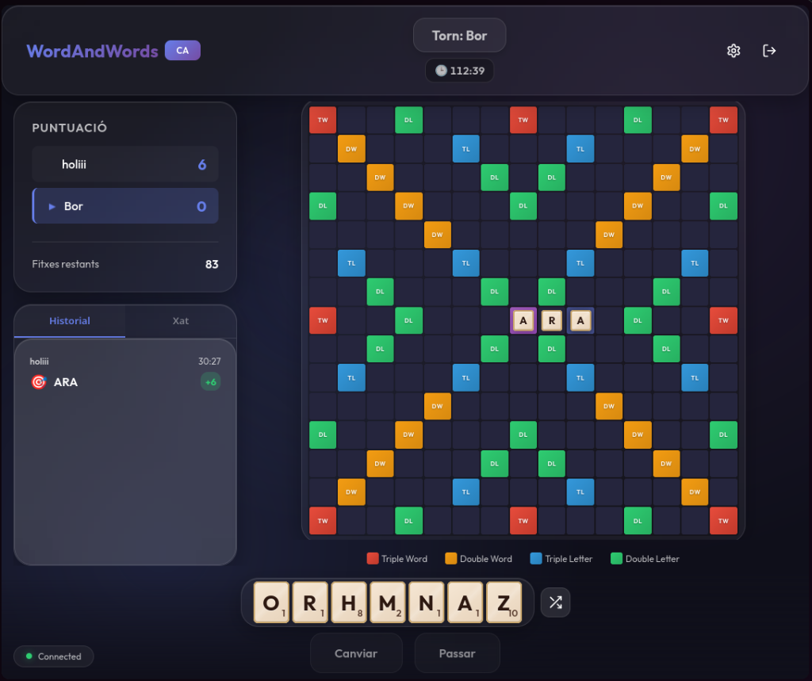
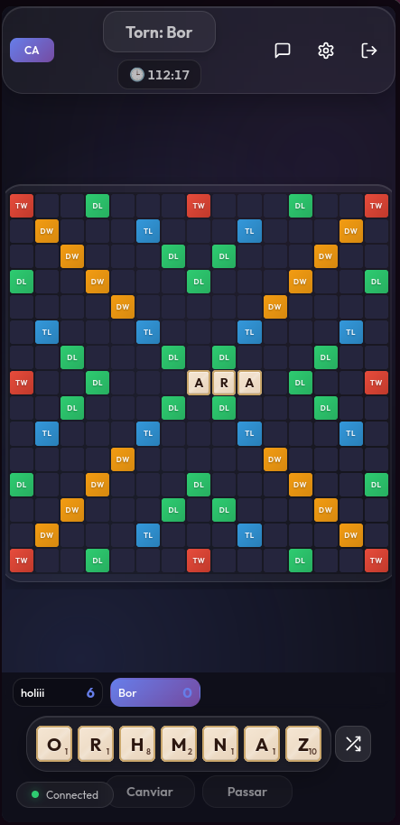

# Word & Words

Un juego de palabras multijugador en tiempo real inspirado en Scrabble, construido con tecnologías web modernas.

## 🚀 Características

-   **Multijugador en Tiempo Real**: Juega contra amigos o extraños usando WebSockets.
-   **Multi-idioma**: Soporte completo para **Español**, **Català** e **English**.
-   **Diseño Moderno**: Interfaz "Glassmorphism" limpia, animaciones suaves y diseño totalmente responsivo (móvil y escritorio).
-   **Reglas Flexibles**: Opciones para límite de tiempo, "Modo Estricto" (penalización por palabras inválidas), y más.
-   **Chat y Emotes**: Comunícate con tus oponentes durante la partida.

## � Capturas de Pantalla

<p align="center">
  
  
</p>

## 📱 Diseño Responsivo

Word & Words ha sido diseñado meticulosamente para funcionar en cualquier dispositivo:

-   **Escritorio**: Disfruta de una experiencia amplia con barra lateral, chat visible y tablero de alta resolución.
-   **Móvil**: La interfaz se adapta automáticamente:
    -   El tablero maximiza el espacio vertical disponible.
    -   Los menús y el chat se mueven a paneles accesibles (drawer/modal).
    -   Controles táctiles optimizados (arrastrar y soltar, tocar para colocar, pellizcar para zoom).

## �🛠️ Stack Tecnológico

### Cliente (Frontend)
-   **React** (Vite): Framework principal.
-   **Socket.IO Client**: Para comunicación en tiempo real.
-   **CSS Modules**: Estilos modulares y mantenibles.
-   **Canvas Confetti**: Efectos de celebración.

### Servidor (Backend)
-   **Node.js & Express**: Servidor API.
-   **Socket.IO**: Motor de juego en tiempo real.
-   **Motor de Juego Personalizado**: Lógica de validación de tablero, puntuación y gestión de turnos.

## 📦 Instalación y Despliegue

### Requisitos Previos
-   Node.js v18+
-   Docker (Opcional, para despliegue contenerizado)

### Desarrollo Local (Manual)

1.  **Clonar el repositorio**:
    ```bash
    git clone https://github.com/tu-usuario/wordandwords.git
    cd wordandwords
    ```

2.  **Instalar dependencias**:
    ```bash
    # Servidor
    cd server
    npm install
    
    # Cliente
    cd ../client
    npm install
    ```

3.  **Configurar Entorno**:
    Crea un archivo `.env` en la carpeta `server` (puedes copiar `.env.example`).

4.  **Iniciar en Desarrollo**:
    Necesitarás dos terminales:
    ```bash
    # Terminal 1 (Servidor)
    cd server
    npm run dev
    
    # Terminal 2 (Cliente)
    cd client
    npm run dev
    ```

### Despliegue con Docker (Recomendado)

El proyecto incluye configuración lista para Docker Compose.

```bash
docker-compose up -d --build
```
Esto levantará:
-   Cliente (Nginx) en puerto 80/443
-   Servidor (Node) en puerto 3001

## 📖 Cómo Jugar

1.  **Crear Sala**: Elige idioma, nombre de jugador y configuraciones (tiempo, etc.).
2.  **Invitar**: Comparte el código de sala con tu amigo.
3.  **Jugar**:
    -   Arrastra fichas al tablero.
    -   La primera palabra debe pasar por la estrella central (★).
    -   Palabras siguientes deben conectar con las existentes.
    -   ¡Usa las casillas especiales (DL, TL, DW, TW) para multiplicar tu puntuación!

## 🤝 Contribución

Las contribuciones son bienvenidas. Por favor, abre un "Issue" o "Pull Request" para discutir cambios mayores.

## 📄 Licencia

MIT
